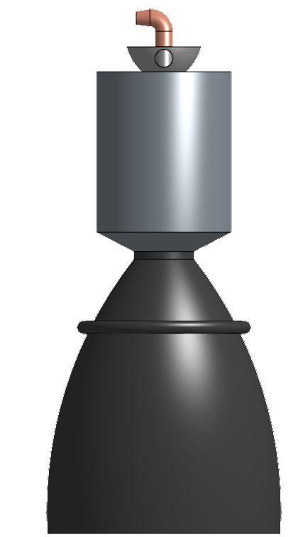
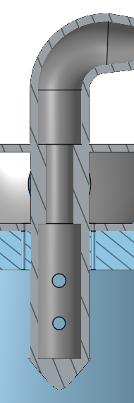
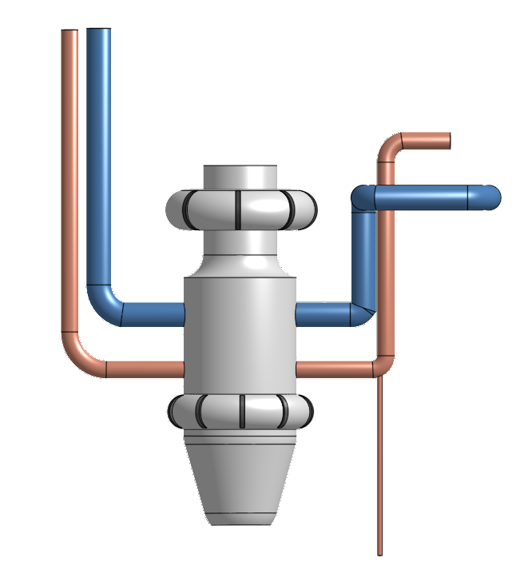
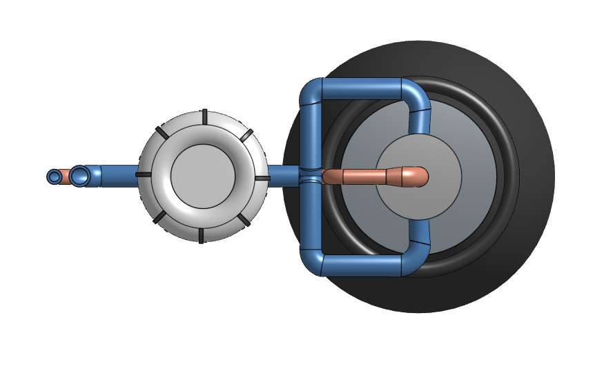

🚀 Merlin 1D-Inspired Rocket Engine
> Simplified CAD model of a SpaceX Merlin 1D-inspired rocket engine, with cold-flow CFD simulations of the LOX and RP-1 injection paths.

---
📖 Overview
---
- This project is a CAD model of a rocket engine inspired by the SpaceX Merlin 1D, built in OnShape. I picked the Merlin because SpaceX rockets are what got me interested in this field in the first place.
- The goal was not to make an exact copy of the Merlin. It's a simplified model that focuses on the main components and the overall architecture, while skipping internal details that would not be visible from outside or would take too much time to model properly.
- After finishing the model I also ran two cold-flow CFD simulations in SimScale, one for LOX and one for RP-1, to learn the workflow and see how the propellants behave in the injection geometry.
---
🎯 Scope & Design Decisions
---
A few of the main choices I made and why:
- Gas generator cycle - same as the real Merlin. Simpler to represent than staged combustion and matches the engine I was inspired by.
- Pintle injector - The Merlin uses a pintle, not a concentric ring injector. I went with the more accurate option.
- Color-coded plumbing - blue for LOX, copper for RP-1. Less realistic than all-metal pipes but makes the flow paths much easier to follow at a glance.
---
🔧 Components
---
Combustion Chamber & Nozzle
- Built as a single revolved body from a half-profile sketch. The profile includes the cylindrical chamber, the converging section, the throat, and the bell nozzle as one continuous shape.
 


Injector Dome & Pintle
- The dome sits on top of the chamber and houses the pintle injector. The pintle has a central fuel passage with radial holes near the bottom where RP-1 sprays out, and a solid tip. LOX enters the dome from two side inlets, fills the dome cavity, and drops into the chamber through 16 small holes patterned around the pintle.




Fuel Inlet Manifold Ring
- The thick ring at the chamber-to-nozzle junction. On a real Merlin this is where pressurized RP-1 enters the cooling jacket before flowing up to the injector. In my model it's a visual feature that anchors the cooling system and provides a connection point for the RP-1 outlet pipe from the turbopump.

Turbopump Assembly
- Two stacked cylinders representing the pump and turbine housings, with a gas generator sticking out the side and a small exhaust cone at the bottom. I added segmented flange details where the housings meet to make it look more mechanical. Internal turbomachinery (blades, shafts) is not modeled.



Plumbing
- Four main pipes connect the turbopump to the engine:
- Two inlet pipes coming from above (implied tank connections)
- One RP-1 outlet pipe going to the fuel manifold ring
- One LOX outlet pipe that splits into a Y and feeds both dome LOX inlets



---
🌊 Flow Simulations
---
- I ran two cold-flow CFD simulations in SimScale, even though the task did not require it, because I wanted to learn the workflow and see if I could get meaningful results from my geometry.
---
🛠️ Tools Used
---
- OnShape — CAD modeling
- SimScale — CFD simulations
- Reference material — SpaceX public photos and documentation
---
📂 Repository Contents
---
```
Merlin-1D-Engine/
├── README.md
├── LICENSE
├── /images/              ← Screenshots of the model and simulations
├── /cad-files/           ← STEP export of the engine
├── /simulations/         ← CFD result images and notes
└── /references/          ← Reference photos used
```
---
📝 Note on the Model
- This model is inspired by the publicly visible architecture of the SpaceX Merlin 1D engine. All dimensions, internal details, and design simplifications are my own interpretations based on publicly available photos and information. This is a learning project, not a reproduction of proprietary engineering data.
---
