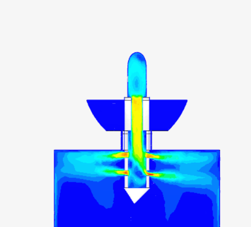
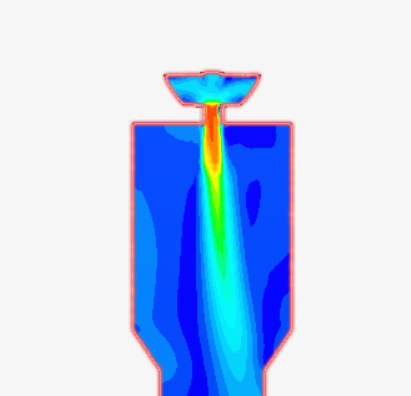

🌊 CFD Simulation Notes
> Detailed notes on the cold-flow CFD simulations run in SimScale.

---
🎯 Goal of the Simulations:
---
> I ran these simulations because I wanted to learn how CFD setup works and see if my engine geometry could produce meaningful flow results. The point was learning the workflow, not validating any engineering performance.
---
🧪 LOX Flow Simulation:
---
Fluid Properties:
- Density: 1140 kg/m³
- Kinematic viscosity: 1.75 × 10⁻⁷ m²/s
Inlet Conditions
- Velocity inlet at the dome side LOX entry, set at 5 m/s.
- LOX entering the dome cavity, distributing through the 16 LOX holes, and entering the chamber.
Results
- The simulation showed a high-velocity central jet penetrating down through the chamber, with the velocity dropping sharply as the flow spread into the larger chamber volume. The pattern matches what would be expected for a confined liquid jet entering a much larger open volume.
  

---
🧪 RP-1 Flow Simulation:
---
Fluid Properties.
- Density: 810 kg/m³.
- Kinematic viscosity: 2.6 × 10⁻⁶ m²/s
Inlet Conditions
- Velocity inlet at the top of the pintle's central fuel passage, set at 5 m/s.
- RP-1 flowing down through the pintle's internal passage, exiting through the radial fuel holes, and entering the chamber.
Results
- The radial jets through the pintle holes are clearly visible as high-velocity streams shooting sideways into the chamber. The flow accelerates significantly as it squeezes through the small holes.
- One observation: the holes did not all flow at exactly the same velocity. Some holes show higher exit velocities than others. On a real injector this would indicate uneven fuel distribution, which would affect combustion uniformity and is a real design consideration.
  

---
---
⚠️ Limitations
---
> These simulations are honest learning exercises, not engineering analyses.
- No combustion. This is cold flow only. The real engine has reacting flow at thousands of degrees, which requires a different solver entirely.
- Simplified geometry. The real Merlin's cooling channels and internal passages are not modeled.
- Chosen inlet conditions. The 5 m/s inlet velocity was chosen for solver stability, not because it represents actual engine operating conditions.
- No multi-phase or reacting flow. Propellants are treated as simple single-phase incompressible liquids.
- The value of these simulations is showing that I can set up, troubleshoot, and run a CFD case to convergence, not claiming I have validated a rocket engine design.
